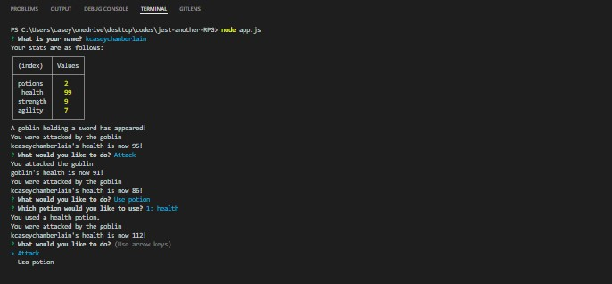

# Jest Another RPG

### Description
This application is command-line role-playing game (RPG) in which the user battles a series of enemies whose health and stats can be sustained by taking a potion. The game is played through the npm package inquirer.
### License

This application is licensed under MIT

### Application Demo

### Table of Contents
- [Description](#description)
- [Contributing](#contributing)
- [Tests](#tests)
- [Questions?](#questions)

### Contributing
No contributions at this time.

### Tests
Enemy: gets enemy's health value, gets a description of the enemy, checks if enemy is alive or not, gets enemy's attack value, subtracts from enemy's health.

Player: creates a player object, gets player's health value, gets player's stats as an object, checks if player is alive or not, gets inventory from player or returns false, adds a potion to the inventory, uses a potion from inventory, gets player's attack value, subtracts from player's health.

Potion: creates a health potion object, creates a random potion object.

### Questions
GitHub Username: (kcaseychamberlain) 

View the project in GitHub at: https://github.com/KCaseyChamberlain/jest-another-RPG

Clone the repository to your local device and run the command "node app.js" from the root directory to run this application.

If you have any questions, contact Casey at: caseygchamberlain@gmail.com
